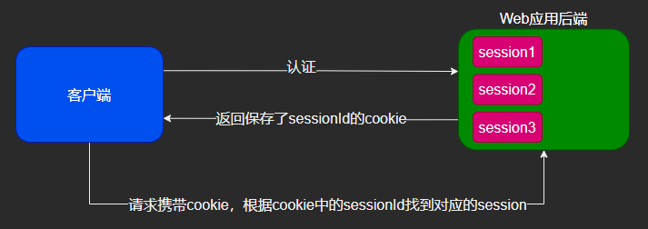
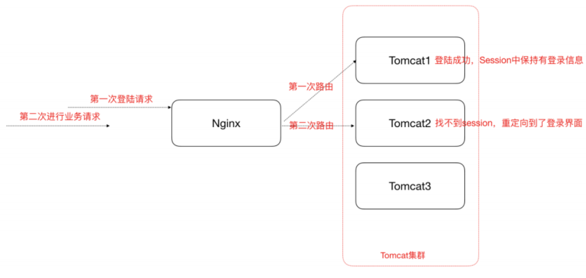

# 为什么要用JWT

## 传统Session认证的弊端

我们知道**HTTP本身是一种无状态的协议**，这就意味着如果用户向我们的应用提供了用户名和密码来进行用户认证，认证通过后HTTP协议不会记录下认证后的状态，那么下一次请求时，用户还要再一次进行认证，因为根据HTTP协议，我们并不知道是哪个用户发出的请求，所以为了让我们的应用能识别是哪个用户发出的请求，我们只能在用户首次登录成功后，在服务器存储一份用户登录的信息，这份登录信息会在响应时传递给浏览器，告诉其保存为`cookie`，以便下次请求时发送给我们的应用，这样我们的应用就能识别请求来自哪个用户了，这是传统的基于`session`认证的过程。

然而，传统的`session`认证有如下的问题：

- **对于非浏览器的客户端、手机移动端等不适用**，因为`session`依赖于`cookie`，而移动端通常没有`cookie`。
- 由于基于`cookie`，而cookie无法跨域，所以session的认证也无法跨域，对单点登录不适用。
- 因为`session`认证本质基于`cookie`，而浏览器可以选择禁用`cookie`。并且`cookie`一旦被截获，用户很容易受到跨站请求伪造攻击。
- 每个用户的登录信息都会保存到服务器的`session`中，**随着用户的增多，服务器开销会明显增大**。
- 由于`session`是存在于服务器的物理内存中，所以**在分布式系统中，这种方式将会失效**。虽然可以将`session`统一保存到`Redis`中，但是这样做无疑增加了系统的复杂性，对于本不需要`Redis`的应用也会因此额外多引入一个缓存中间件。

- 前后端分离系统中更加不适用，后端部署复杂，前端发送的请求往往经过多个中间件到达后端，`cookie`中关于`session`的信息会转发多次。

## 基于token的认证

**用户身份验证流程：**

1. 客户端使用用户名和密码请求登录
2. 服务端收到请求，验证用户名和密码
3. 验证成功后，服务端会签发一个`token`，再把这个`token`返回给客户端
4. 客户端收到token后可以把它存储起来，比如放到`cookie`中
5. 客户端每次向服务端请求资源时需要携带服务端签发的`token`，可以在`cookie`或者`header`中携带
6. 服务端收到请求，然后去验证客户端请求里面带着的`token`，如果验证成功，就向客户端返回请求数据

这种基于`token`的认证方式相比传统的`session`认证方式更节约服务器资源，并且对移动端和分布式更加友好。其优点如下：

- **支持跨域访问**：`cookie`是无法跨域的，而`token`由于没有用到`cookie`(前提是将`token`放到请求头中)，所以跨域后不会存在信息丢失问题。
- **无状态**：`token`机制在服务端不需要存储`session`信息，因为`token`自身包含了所有登录用户的信息，所以可以减轻服务端压力。
- **更适用CDN**：可以通过内容分发网络请求服务端的所有资料。
- **更适用于移动端**：当客户端是非浏览器平台时，`cookie`是不被支持的，此时采用`token`认证方式会简单很多。
- **无需考虑CSRF**：由于不再依赖`cookie`，所以采用`token`认证方式不会发生CSRF，所以也就无需考虑CSRF的防御。

## JWT

`JWT`就是上述流程当中`token`的一种具体实现方式，其全称是`JSON Web Token`，官网地址：https://jwt.io/

使用`JWT`用户身份认证的大致流程如下：

## `JWT` VS `Redis+token` 

两者的主要区别在于有无状态，使用`JWT`可以保证无状态连接；而`Redis`则可以保存用户状态。